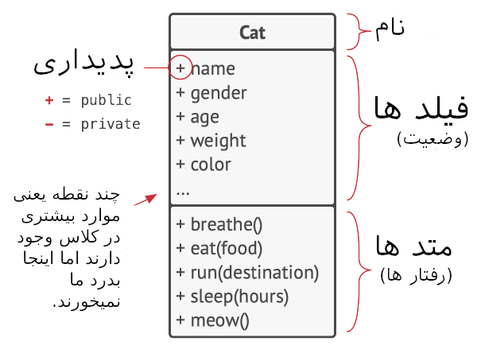
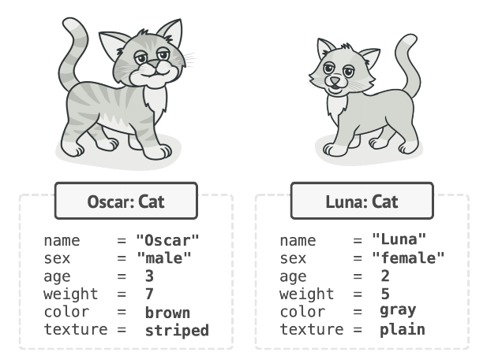
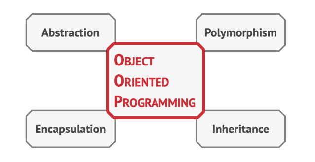

# INTRODUCTION TO OOP

## Basics of OOP

**O**bject-**O**riented **P**rogramming is a paradigm based on the concept of wrapping pieces of data, and behavior  related to that 
data, into special bundles called __objects__, which are constructed from a set of “blueprints”, defined by a programmer, called 
__classes__.

### Objects, classes

Do you like cats? I hope you do because I’ll try to explain the OOP concepts using various cat examples.



_This is a UML class diagram. You’ll see a lot of such diagrams in the book._

Say you have a cat named Oscar. Oscar is an object, an instance of the Cat class. Every `cat` has a lot of standard attributes:
name, sex, age, weight, color, favorite food, etc. These are the class’s fields.

All cats also behave similarly: they breathe, eat, run, sleep and meow. These are the class’s _methods_. Collectively, fields and 
methods can be referenced as the _members_ of their class.

Data stored inside the object’s fields is often referenced as state, and all the object’s methods define its _behavior_.



_Objects are instances of classes._

Luna, your friend’s cat, is also an instance of the `Cat` class. It has the same set of attributes as Oscar. The difference is in
values of these attributes: its sex is female, it has a different color, and weighs less.

So a _class_ is like a blueprint that defines the structure for objects, which are concrete instances of that class.

### Class hierarchies

Everything’s fine and dandy when we talk about one class. Naturally, a real program contains more than a single class. Some of these 
classes might be organized into __class hierarchies__. Let’s find out what that means.

Say your neighbor has a dog called Fido. It turns out, dogs and cats have a lot in common: name, sex, age, and color are attributes 
of both dogs and cats. Dogs can breathe, sleep and run the same way cats do. So it seems that we can define the base `Animal` class 
that would list the common attributes and behaviors.

A parent class, like the one we’ve just defined, is called a __superclass__. Its children are __subclasses__. Subclasses inherit 
state and behavior from their parent, defining only attributes or behaviors that differ. Thus, the `Cat` class would have the `meow` 
method, and the `Dog` class the `bark` method.


_UML diagram of a class hierarchy. All classes in this diagram are part of the `Animal` class hierarchy._

Assuming that we have a related business requirement, we can go even further and extract a more general class for all living 
`Organisms` which will become a superclass for `Animals` and `Plants` . Such a pyramid of classes is a __hierarchy__. In such a 
hierarchy, the `Cat` class inherits everything from both the `Animal` and `Organism` classes.


_Classes in a UML diagram can be simplified if it’s more important to show their relations than their contents._

Subclasses can override the behavior of methods that they inherit from parent classes. A subclass can either completely replace the 
default behavior or just enhance it with some extra stuff.

## Pillars of OOP

Object-oriented programming is based on four pillars, concepts that differentiate it from other programming paradigms.



### Abstraction

Most of the time when you’re creating a program with OOP, you shape objects of the program based on real-world objects. However, 
objects of the program don’t represent the originals with 100% accuracy (and it’s rarely required that they do). Instead, your 
objects only _model_ attributes and behaviors of real objects in a specific context, ignoring the rest.

For example, an `Airplane` class could probably exist in both a flight simulator and a flight booking application. But in the former 
case, it would hold details related to the actual flight, whereas in the latter class you would care only about the seat map and 
which seats are available.


_Different models of the same real-world object._

_Abstraction_ is a model of a real-world object or phenomenon, limited to a specific context, which represents all details relevant to this context with high 
accuracy and omits all the rest.

### Encapsulation

To start a car engine, you only need to turn a key or press a button. You don’t need to connect wires under the hood, rotate the 
crankshaft and cylinders, and initiate the power cycle of the engine. These details are hidden under the hood of the car. You have 
only a simple interface: a start switch, a steering wheel and some pedals. This illustrates how each object has an __interface__—a 
public part of an object, open to interactions with other objects.

_Encapsulation_ is the ability of an object to hide parts of its state and behaviors from other objects, exposing only a limited 
interface to the rest of the program.

To _encapsulate_ something means to make it `private` , and thus accessible only from within the methods of its own class. There’s a 
little bit less restrictive mode called `protected` that makes a member of a class available to subclasses as well.

Interfaces and abstract classes/methods of most programming languages are based on the concepts of abstraction and encapsulation. In 
modern object-oriented programming languages, the interface mechanism (usually declared with the `interface` or `protocol` keyword) 
lets you define contracts of interaction between objects. That’s one of the reasons why the interfaces only care about behaviors of 
objects, and why you can’t declare a field in an interface.

The fact that the word interface stands for a public part of an object, while there’s also the `interface` type in most programming 
languages, is very confusing. I’m with you on that.

Imagine that you have a `FlyingTransport` interface with a method `fly(origin, destination, passengers)` . When designing an air 
transportation simulator, you could restrict the `Airport` class to work only with objects that implement the `FlyingTransport`  
interface. After this, you can be sure that any object passed to an airport object, whether it’s an `Airplane` ,a `Helicopter` or a 
freaking `DomesticatedGryphon` would be able to arrive or depart from this type of airport.


_UML diagram of several classes implementing an interface._

You could change the implementation of the `fly` method in these classes in any way you want. As long as the signature of the method 
remains the same as declared in the interface, all instances of the `Airport` class can work with your flying objects just fine.

### Inheritance

_Inheritance_ is the ability to build new classes on top of existing ones. The main benefit of inheritance is code reuse. If you 
want to create a class that’s slightly different from an existing one, there’s no need to duplicate code. Instead, you extend the 
existing class and put the extra functionality into a resulting subclass, which inherits fields and methods of the superclass.

The consequence of using inheritance is that subclasses have the same interface as their parent class. You can’t hide a method in a 
subclass if it was declared in the superclass. You must also implement all abstract methods, even if they don’t make sense for your 
subclass.


_UML diagram of extending a single class versus implementing multiple interfaces at the same time._

In most programming languages a subclass can extend only one superclass. On the other hand, any class can implement several 
interfaces at the same time. But, as I mentioned before, if a superclass implements an interface, all of its subclasses must also 
implement it.

### Polymorphism

Let’s look at some `animal` examples. Most Animals can make sounds. We can anticipate that all subclasses will need to override the  
base `makeSound` method so each subclass can emit the correct sound; therefore we can declare it _abstract_ right away. This lets us 
omit any default implementation of the method in the superclass, but force all subclasses to come up with their own.


Imagine that we’ve put several cats and dogs into a large bag. Then, with closed eyes, we take the animals one-by-one out of the 
bag. After taking an animal from the bag, we don’t know for sure what it is. However, if we cuddle it hard enough, the animal will 
emit a specific sound of joy, depending on its concrete class.

```c#
1   bag = [new Cat(), new Dog()];
2
3   foreach (Animal a : bag)
4     a.makeSound()
5
6   // Meow!
7   // Woof!    
```

The program doesn’t know the concrete type of the object contained inside the `a` variable; but, thanks to the special mechanism 
called _polymorphism_, the program can trace down the subclass of the object whose method is being  executed and run the appropriate 
behavior.

_Polymorphism_ is the ability of a program to detect the real class of an object and call its implementation even when its real type 
is unknown in the current context.

You can also think of polymorphism as the ability of an object to “pretend” to be something else, usually a class it extends or an 
interface it implements. In our example, the dogs and cats in the bag were pretending to be generic animals.

## Relations Between Objects

In addition to _inheritance_ and _implementation_ that we’ve already seen, there are other types of relations between objects that 
we haven’t talked about yet.

### Dependency


_UML Dependency. Professor depends on the course materials._

_Dependency_ is the most basic and the weakest type of relations between classes. There is a dependency between two classes if some 
changes to the definition of one class might result in modifications to another class. Dependency typically occurs when you use 
concrete class names in your code. For example, when specifying types in method signatures, when instantiating objects via 
constructor calls, etc. You can make a dependency weaker if you make your code dependent on interfaces or abstract classes instead 
of concrete classes.

Usually, a UML diagram doesn’t show every dependency—there are far too many of them in any real code. Instead of polluting the 
diagram with dependencies, you should be very selective and show only those that are important to whatever it is you are 
communicating.

### Association


_UML Association. Professor communicates with students._

_Association_ is a relationship in which one object uses or interacts with another. In UML diagrams, the association relationship is 
shown by a simple arrow 
drawn from an object and pointing to the object it uses. By the way, having a bi-directional association is a completely normal 
thing. In this case,the arrow has a point at each end. Association can be seen as a specialized kind of dependency, where an object 
always has access to the objects with which it interacts, whereas simple dependency doesn’t establish a permanent link between 
objects.

In general, you use an association to represent something like a field in a class. The link is always there, in that you can always 
ask an order for its customer. But it doesn’t always have to be a field. If you are modeling your classes from an interface 
perspective, it can just indicate the presence of a method that will return the order’s customer.

To solidify your understanding of the difference between association and dependency, let’s look at a combined example. Imagine that 
we have a `Professor` class:

``` c#
1   class Professor is
2     field Student student
3     // ...
4     method teach(Course c) is
5       // ...
6       this.student.remember(c.getKnowledge())
```

Take a look at the `teach` method. It takes an argument of the `Course` class, which is then used in the body of the method. If 
someone changes the `getKnowledge` method of the `Course` class (alters its name, or adds some required parameters, etc.) our code 
will break. This is called a dependency.

Now, look at the `student` field and how it’s used in the `teach` method. We can say for sure that the `Student` class is also a 
dependency for the `Professor` : if the method `remember` changes, the `Professor` ’s code will break. However, 
since the `student` field is always accessible to any method of the `Professor` , the ``Student`` class is not just a dependency, 
but also an association.

### Aggregation


_UML Aggregation. Department contains professors._

_Aggregation_ is a specialized type of association that represents “one-to-many”, “many-to-many” or “whole-part” relations between 
multiple objects.

Usually, under aggregation, an object “has” a set of other objects and serves as a container or collection. The component can exist 
without the container and can be linked to several containers at the same time. In UML the aggregation relationship is shown by a 
line with an empty diamond at the container end and an arrow at the end pointing toward the component.

While we talk about relations between objects, keep in mind that UML represents relations between _classes_. It means that a 
university object might consist of multiple departments even though you see just one “block” for each entity in the diagram. UML 
notation can represent quantities on both sides of relationships, but it’s okay to omit them if the quantities are clear from the 
context.

### Composition


_UML Composition. University consists of departments._

_Composition_ is a specific kind of aggregation, where one object is composed of one or more instances of the other. The distinction 
between this relation and others is that the component can only exist as a part of the container. In UML the composition 
relationship is drawn the same as for aggregation, but with a filled diamond at the arrow’s base.

Note that many people often use the term “composition” when they really mean both the aggregation and composition. The most 
notorious example for this is the famous principle “choose composition over inheritance.” It’s not because people are ignorant about 
the difference, but rather because the word “composition” (e.g. “object composition”) sounds more natural in the English language.

### The big picture

Now that we know all types of relations between objects let’s see how they all are connected. Hopefully, this will guide you through 
questions like “what is the difference between aggregation and composition” or “is inheritance a type of dependency?”

- __Dependency:__ Class А can be affected by changes in class B.
- __Association:__ Object А knows about object B. Class A depends on B.
- __Aggregation:__ Object А knows about object B, and consists of B. Class A depends on B.
- __Composition:__ Object А knows about object B, consists of B, and manages B’s life cycle. Class A depends on B.
- __Implementation:__ Class А defines methods declared in interface B. Objects A can be treated as B. Class A depends on B.
- __Inheritance:__ Class А inherits interface and implementation of class B but can extend it. Objects A can be treated as B. Class 
A depends on B.


Relations between objects and classes: from weakest to strongest.
