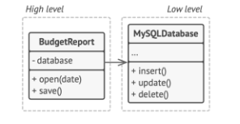
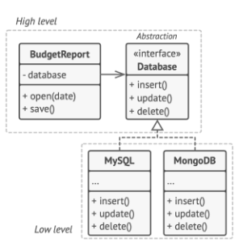

# SOFTWARE DESIGN PRINCIPLES

# Features of Good Design

Before we proceed to the actual patterns, let’s discuss the process of designing software architecture: things to aim for and things you’d better avoid.

## Code reuse

Cost and time are two of the most valuable metrics when developing any software product. Less time in development means entering the market earlier than competitors. Lower development costs mean more money is left for marketing and a broader reach to potential customers.

Code reuse is one of the most common ways to reduce development costs. The intent is pretty obvious: instead of developing something over and over from scratch, why don’t we reuse existing code in new projects?

The idea looks great on paper, but it turns out that making existing code work in a new context usually takes extra effort. Tight coupling between components, dependencies on concrete classes instead of interfaces, hardcoded operations—all of this reduces flexibility of the code and makes it harder to reuse it.

Using design patterns is one way to increase flexibility of software components and make them easier to reuse. However, this sometimes comes at the price of making the components more complicated.

Here’s a piece of wisdom from Erich [Gamma](https://refactoring.guru/gamma-interview), one of the founding fathers of design patterns, about the role of design patterns in code reuse:

> I see three levels of reuse.
>
> At the lowest level, you reuse classes: class libraries, containers, maybe some class “teams” like container/iterator.
>
> Frameworks are at the highest level. They really try to distill your design decisions. They identify the key abstractions for solving a problem, represent them by classes and define relationships between them. JUnit is a small framework, for example. It is the “Hello, world” of frameworks. It has `Test` ,`TestCase` , `TestSuite` and relationships defined.
> 
> A framework is typically larger-grained than just a single class. Also, you hook into frameworks by 
> sub classing somewhere. They use the so-called Hollywood principle of “don’t call us, we’ll call you.” 
> The framework lets you define your custom behavior, and it will call you when it’s your turn to do some thing. Same with JUnit, right? It calls you when it wants to execute a test for you, but the rest happens in the framework.
> 
> There also is a middle level. This is where I see patterns. Design patterns are both smaller and more abstract than frameworks. They’re really a description about how a couple of classes can relate to and interact with each other. The level of reuse increases when you move from classes to patterns and finally frameworks.
> 
> What is nice about this middle layer is that patterns offer reuse in a way that is less risky than frameworks. Building a framework is high-risk and a significant investment. Patterns let you reuse design ideas and concepts independently of concrete code.

## Extensibility

**Change** is the only constant thing in a programmer’s life.

- You released a video game for Windows, but now people ask for a macOS version.
- You created a GUI framework with square buttons, but several months later round buttons become a trend.
- You designed a brilliant e-commerce website architecture, but just a month later customers ask for a feature that would let them accept phone orders.

Each software developer has dozens of similar stories. There are several reasons why this happens.

First, we understand the problem better once we start to solve it. Often by the time you finish the first version of an app, you’re ready to rewrite it from scratch because now you understand many aspects of the problem much better. You have also grown professionally, and your own code now looks like crap.

Something beyond your control has changed. This is why so many dev teams pivot from their original ideas into something new. Everyone who relied on Flash in an online application has been reworking or migrating their code as browser after browser drops support for Flash.

The third reason is that the goalposts move. Your client was delighted with the current version of the application, but now sees eleven “little” changes he’d like so it can do other things he never mentioned in the original planning sessions. These aren’t frivolous changes: your excellent first version has shown him that even more is possible.

> There’s a bright side: if someone asks you to change something in your app, that means someone still cares about it.

That’s why all seasoned developers try to provide for possible future changes when designing an application’s architecture.


# Design Principles

What is good software design? How would you measure it? What practices would you need to follow to achieve it? How can you make your architecture flexible, stable and easy to understand?

These are the great questions; but, unfortunately, the answers are different depending on the type of application you’re building. Nevertheless, there are several universal principles of software design that might help you answer these questions for your own project. Most of the design patterns listed in this book are based on these principles.


## Encapsulate What Varies

> Identify the aspects of your application that vary and separate them from what stays the same.

The main goal of this principle is to minimize the effect caused by changes.

Imagine that your program is a ship, and changes are hideous mines that linger under water. Struck by the mine, the ship sinks.

Knowing this, you can divide the ship’s hull into independent compartments that can be safely sealed to limit damage to a single compartment. Now, if the ship hits a mine, the ship as a whole remains afloat.

In the same way, you can isolate the parts of the program that vary in independent modules, protecting the rest of the code from adverse effects. As a result, you spend less time getting the program back into working shape, implementing and testing the changes. The less time you spend making changes, the more time you have for implementing features.


### Encapsulation on a method level

Say you’re making an e-commerce website. Somewhere in your code, there’s a `getOrderTotal` method that calculates a grand total for the order, including taxes.

We can anticipate that tax-related code might need to change

in the future. The tax rate depends on the country, state or even city where the customer resides, and the actual formula may change over time due to new laws or regulations. As a result, you’ll need to change the `getOrderTotal` method quite often. But even the method’s name suggests that it doesn’t care about *how* the tax is calculated.

```python
method getOrderTotal(order) is
total = 0
foreach item in order.lineItems
total += item.price \* item.quantity

if (order.country == "US") 
  total += total \* 0.07 // US sales tax 
else if (order.country == "EU"): 
  total += total \* 0.20 // European VAT 10
return total

```

*BEFORE: tax calculation code is mixed with the rest of the me thod’scode.*

You can extract the tax calculation logic into a separate method, hiding it from the original method.

```python
1  method getOrderTotal(order) is
2  total = 0
3  foreach item in order.lineItems

4 total += item.price \* item.quantity

5

6 total += total \* getTaxRate(order.country) 7

8 return total 9

10 method getTaxRate(country) is 11 if (country == "US")

12 return 0.07 // US sales tax

13 else if (country == "EU")

14 return 0.20 // European VAT

15 else

16 return 0

```

*AFTER: you can get the tax rate b y calling a designated method.*

Tax-related changes become isolated inside a single method. Moreover, if the tax calculation logic becomes too complicated, it’s now easier to move it to a separate class.

### Encapsulation on a class level

Over time you might add more and more responsibilities to a method which used to do a simple thing. These added behaviors often come with their own helper fields and methods that eventually blur the primary responsibility of the containing class. Extracting everything to a new class might make things much more clear and simple.

<div align="center">


*BEFORE: calculating tax in* `Order` *class.*

</div>

Objects of the `Order` class delegate all tax-related work to a special object that does just that.

<div align="center">


*AFTER: tax calculation is hidden from the* `Order` *class.*

</div>

# Program to an Interface, not an Implementation

> Program to an interface, not an implementation. Depend on abstractions, not on concrete classes.

You can tell that the design is flexible enough if you can easily extend it without breaking any existing code. Let’s make sure that this statement is correct by looking at another cat example. A `Cat` that can eat any food is more flexible than one that can eat just sausages. You can still feed the first cat with sausages because they are a subset of “any food”; however, you can extend that cat’s menu with any other food.

When you want to make two classes collaborate, you can start by making one of them dependent on the other. Hell, I often start by doing that myself. However, there’s another, more flexible way to set up collaboration between objects:

1. Determine what exactly one object needs from the other: which methods does it execute?
2. Describe these methods in a new interface or abstract class.
3. Make the class that is a dependency implement this interface.
4. Now make the second class dependent on this interface rather than on the concrete class. You still can make it work with


objects of the original class, but the connection is now much more flexible.

<div align="center">


*Before and after extracting the interface. The code on the right is more flexible than the code on the left, but it’s also more complicated.*

</div>

After making this change, you won’t probably feel any immediate benefit. On the contrary, the code has become more complicated than it was before. However, if you feel that this might be a good extension point for some extra functionality, or that some other people who use your code might want to extend it here, then go for it.


### Example

Let’s look at another example which illustrates that working with objects through interfaces might be more beneficial than depending on their concrete classes. Imagine that you’re creating a software development company simulator. You have different classes that represent various employee types.

<div align="center">


*BEFORE: all classes are tightlycoupled.*

</div>

In the beginning, the Company class is tightly coupled to concrete classes of employees. However, despite the difference in their implementations, we can generalize various work-related methods and then extract a common interface for all employee classes.

After doing that, we can apply polymorphism inside the `Company` class, treating various employee objects via the `Employee` interface.

<div align="center">


*BETTER: polymorphism helped us simplify the code, but the rest of the* `Company` *class still depends on the concrete employee classes.)*

</div>

The `Company` class remains coupled to the employee classes. This is bad because if we introduce new types of companies that work with other types of employees, we’ll need to override most of the `Company` class instead of reusing that code.

To solve this problem, we could declare the method for getting employees as *abstract*. Each concrete company will implement this method differently, creating only those employees that it needs.

<div align="center">


*AFTER: the primary method of the* `Company` *class is independent from concrete employee classes. Employee objects are created in concrete company subclasses.*

</div>

After this change, the `Company` class has become independent from various employee classes. Now you can extend this class and introduce new types of companies and employees while still reusing a portion of the base company class. Extending the base company class doesn’t break any existing code that already relies on it.

By the way, you’ve just seen applying a design pattern in action! That was an example of the *Factory Method* pattern. Don’t worry: we’ll discuss it later in detail.

# Favor Composition Over Inheritance

Inheritance is probably the most obvious and easy way of reusing code between classes. You have two classes with the same code. Create a common base class for these two and move the similar code into it. Piece of cake!

Unfortunately, inheritance comes with caveats that often become apparent only after your program already has tons of classes and changing anything is pretty hard. Here’s a list of those problems.

- **A subclass can’t reduce the interface of the superclass**. You have to implement all abstract methods of the parent class even if you won’t be using them.
- **When overriding methods you need to make sure that the new behavior is compatible with the base one**. It’s important because objects of the subclass may be passed to any code that expects objects of the superclass and you don’t want that code to break.
- **Inheritance breaks encapsulation of the superclass** because the internal details of the parent class become available to the subclass. There might be an opposite situation where a programmer makes a superclass aware of some details of subclasses for the sake of making further extension easier.

- **Subclasses are tightly coupled to superclasses**. Any change in a superclass may break the functionality of subclasses.
- **Trying to reuse code through inheritance can lead to creating parallel inheritance hierarchies**. Inheritance usually takes place in a single dimension. But whenever there are two or more dimensions, you have to create lots of class combinations, bloating the class hierarchy to a ridiculous size.

There’s an alternative to inheritance called *composition*. Whereas inheritance represents the “is a” relationship between classes (a car *is a* transport), composition represents the “has a” relationship (a car *has an* engine).

I should mention that this principle also applies to aggregation—a more relaxed variant of composition where one object may have a reference to the other one but doesn’t manage its lifecycle. Here’s an example: a car *has a* driver, but he or she may use another car or just walk *without the car*.

### Example

Imagine that you need to create a catalog app for a car manufacturer. The company makes both cars and trucks; they can be either electric or gas; all models have either manual controls or an autopilot.

<div align="center">


*INHERITANCE: extending a class in several dimensions (cargo type × engine type × navigation type) may lead to a combinatorial explosion of subclasses.*

</div>

As you see, each additional parameter results in multiplying the number of subclasses. There’s a lot of duplicate code between subclasses because a subclass can’t extend two classes at the same time.

You can solve this problem with composition. Instead of car objects implementing a behavior on their own, they can delegate it to other objects.

The added benefit is that you can replace a behavior at runtime. For instance, you can replace an engine object linked to a car object just by assigning a different engine object to the car.

<div align="center">


*COMPOSITION: different “dimensions” of functionality extracted to their own class hierarchies.*

</div>

This structure of classes resembles the *Strategy* pattern, which we’ll go over later in this book.


# SOLID Principles

Now that you know the basic design principles, let’s take a look at five that are commonly known as the SOLID principles. Robert Martin introduced them in the book *Agile Software*

*Development, Principles, Patterns, and [Practices](https://refactoring.guru/principles-book).

*SOLID*is a mnemonic for five design principles intended to make software designs more understandable, flexible and maintainable.

As with everything in life, using these principles mindlessly can cause more harm than good. The cost of applying these principles into a program’s architecture might be making it more complicated than it should be. I doubt that there’s a successful software product in which all of these principles are applied at the same time. Striving for these principles is good, but always try to be pragmatic and don’t take everything written here as dogma.

# Single Responsibility Principle

> A class should have just one reason to change.

Try to make every class responsible for a single part of the functionality provided by the software, and make that responsibility entirely encapsulated by (you can also say *hidden within*) the class.

The main goal of this principle is reducing complexity. You don’t need to invent a sophisticated design for a program that only has about 200 lines of code. Make a dozen methods pretty, and you’ll be fine.

The real problems emerge when your program constantly grows and changes. At some point classes become so big that you can no longer remember their details. Code navigation slows down to a crawl, and you have to scan through whole classes or even an entire program to find specific things. The number of entities in program overflows your brain stack, and you feel that you’re losing control over the code.

There’s more: if a class does too many things, you have to change it every time one of these things changes. While doing that, you’re risking breaking other parts of the class which you didn’t even intend to change.

If you feel that it’s becoming hard to focus on specific aspects of the program one at a time, remember the single responsibility principle and check whether it’s time to divide some classes into parts.

### Example

The `Employee` class has several reasons to change. The first reason might be related to the main job of the class: managing employee data. However, there’s another reason: the format of the timesheet report may change over time, requiring you to change the code within the class.

<div align="center">


*BEFORE: the class contains several different behaviors.*

</div>

Solve the problem by moving the behavior related to printing timesheet reports into a separate class. This change lets you move other report-related stuff to the new class.

<div align="center">


*AFTER: the extra behavior is in its own class.*

</div>


# Open/Closed Principle

> Classes should be open for extension but closed for modification.

The main idea of this principle is to keep existing code from breaking when you implement new features.

A class is *open* if you can extend it, produce a subclass and do whatever you want with it—add new methods or fields, override base behavior, etc. Some programming languages let you restrict further extension of a class with special keywords, such as `final` . After this, the class is no longer open. At the same time, the class is *closed* (you can also say *complete*) if it’s 100% ready to be used by other classes—its interface is clearly defined and won’t be changed in the future.

When I first learned about this principle, I was confused because the words *open* & *closed* sound mutually exclusive. But in terms of this principle, a class can be both open (for extension) and closed (for modification) at the same time.

If a class is already developed, tested, reviewed, and included in some framework or otherwise used in an app, trying to mess with its code is risky. Instead of changing the code of the class directly, you can create a subclass and override parts of the original class that you want to behave differently. You’ll achieve your goal but also won’t break any existing clients of the original class.

This principle isn’t meant to be applied for all changes to a class. If you know that there’s a bug in the class, just go on and fix it; don’t create a subclass for it. A child class shouldn’t be responsible for the parent’s issues.

### Example

You have an e-commerce application with an `Order` class that calculates shipping costs and all shipping methods are hardcoded inside the class. If you need to add a new shipping method, you have to change the code of the `Order` class and risk breaking it.

<div align="center">


*BEFORE: you have to change the* Order *class whenever you add a new*

*shipping method to the app.*

</div>


You can solve the problem by applying the *Strategy* pattern. Start by extracting shipping methods into separate classes with a common interface.

<div align="center">


*AFTER: adding a new shipping method doesn’t require changing existing classes.*

</div>

Now when you need to implement a new shipping method, you can derive a new class from the `Shipping` interface without touching any of the `Order` class’ code. The client code of the `Order` class will link orders with a shipping object of the new class whenever the user selects this shipping methods in the UI.

As a bonus, this solution let you move the delivery time calculation to more relevant classes, according to the *single responsibility principle*.


# [Liskov Substitution Principle](https://refactoring.guru/liskov/dah)

> When extending a class, remember that you should be able to pass objects of the subclass in place of objects of the parent class without breaking the client code.

This means that the subclass should remain compatible with the behavior of the superclass. When overriding a method, extend the base behavior rather than replacing it with something else entirely.

The substitution principle is a set of checks that help predict whether a subclass remains compatible with the code that was able to work with objects of the superclass. This concept is critical when developing libraries and frameworks because your classes are going to be used by other people whose code you can’t directly access and change.

Unlike other design principles which are wide open for interpretation, the substitution principle has a set of formal requirements for subclasses, and specifically for their methods. Let’s go over this checklist in detail.


- **Parameter types in a method of a subclass should *match* or be *more abstract* than parameter types in the method of the superclass.** Sounds confusing? Let’s have an example.
- Say there’s a class with a method that’s supposed to feed cats: `feed(Cat c)` . Client code always passes cat objects into this method.
- **Good:**Say you created a subclass that overrode the method so that it can feed any animal (a superclass of cats): `feed(Animal c)` . Now if you pass an object of this subclass instead of an object of the superclass to the client code, everything would still work fine. The method can feed all animals, so it can still feed any cat passed by the client.
- **Bad:**You created another subclass and restricted the feeding method to only accept Bengal cats (a subclass of cats): `feed(BengalCat c)` . What will happen to the client code if you link it with an object like this instead of with the original class? Since the method can only feed a specific breed of cats, it won’t serve generic cats passed by the client, breaking all related functionality.
- **The return type in a method of a subclass should *match* or be a *subtype* of the return type in the method of the superclass.** As you can see, requirements for a return type are inverse to requirements for parameter types.

- Say you have a class with a method `buyCat(): Cat` . The client code expects to receive any cat as a result of executing this method.
- **Good:** A subclass overrides the method as follows: `buyCat(): BengalCat` . The client gets a Bengal cat, which is still a cat, so everything is okay.
- **Bad:** A subclass overrides the method as follows: `buyCat(): Animal` . Now the client code breaks since it receives an unknown generic animal (an alligator? a bear?) that doesn’t fit a structure designed for a cat.

Another anti-example comes from the world of programming languages with dynamic typing: the base method returns a string, but the overridden method returns a number.

- **A method in a subclass shouldn’t throw types of exceptions which the base method isn’t expected to throw.** In other words, types of exceptions should *match* or be *subtypes* of the ones that the base method is already able to throw. This rule comes from the fact that `try-catch` blocks in the client code target specific types of exceptions which the base method is likely to throw. Therefore, an unexpected exception might slip through the defensive lines of the client code and crash the entire application.


> In most modern programming languages, especially statically typed ones (Java, C#, and others), these rules are built into the language. You won’t be able to compile a program that violates these rules.

- **A subclass shouldn’t strengthen pre-conditions.** For example, the base method has a parameter with type `int` . If a sub-class overrides this method and requires that the value of an argument passed to the method should be positive (by throwing an exception if the value is negative), this strengthens the pre-conditions. The client code, which used to work fine when passing negative numbers into the method, now breaks if it starts working with an object of this subclass.
- **A subclass shouldn’t weaken post-conditions.** Say you have a class with a method that works with a database. A method of the class is supposed to always close all opened database connections upon returning a value.

You created a subclass and changed it so that database connections remain open so you can reuse them. But the client might not know anything about your intentions. Because it expects the methods to close all the connections, it may simply terminate the program right after calling the method, polluting a system with ghost database connections.

- **Invariants of a superclass must be preserved.** This is probably the least formal rule of all. *Invariants* are conditions in which an object makes sense. For example, invariants of a cat are having four legs, a tail, ability to meow, etc. The confusing part about invariants is that while they can be defined explicitly in the form of interface contracts or a set of assertions within methods, they could also be implied by certain unit tests and expectations of the client code.

The rule on invariants is the easiest to violate because you might misunderstand or not realize all of the invariants of a complex class. Therefore, the safest way to extend a class is to introduce new fields and methods, and not mess with any existing members of the superclass. Of course, that’s not always doable in real life.

- **A subclass shouldn’t change values of private fields of the superclass.** *What? How’s that even possible?* It turns out some programming languages let you access private members of

a class via reflection mechanisms. Other languages (Python, JavaScript) don’t have any protection for the private members at all.

### Example

Let’s look at an example of a hierarchy of document classes that violates the substitution principle.

<div align="center">


*BEFORE: saving doesn’t make sense in a read-only document, so the subclass tries to solve it by resetting the base behavior in the overriddenmethod.*

</div>

The `save` method in the `ReadOnlyDocuments` subclass throws an exception if someone tries to call it. The base method doesn’t have this restriction. This means that the client code will break if we don’t check the document type before saving it.

The resulting code also violates the open/closed principle, since the client code becomes dependent on concrete classes of documents. If you introduce a new document subclass, you’ll need to change the client code to support it.

<div align="center">


*AFTER: the problem is solved after making the read-only document class the base class of the hierarchy.*

</div>

You can solve the problem by redesigning the class hierarchy: a subclass should extend the behavior of a superclass, therefore the read-only document becomes the base class of the hierarchy. The writable document is now a subclass which extends the base class and adds the saving behavior.


# Interface Segregation Principle

> Clients shouldn’t be forced to depend on methods they do not use.

Try to make your interfaces narrow enough that client classes don’t have to implement behaviors they don’t need.

According to the interface segregation principle, you should break down “fat” interfaces into more granular and specific ones. Clients should implement only those methods that they really need. Otherwise, a change to a “fat” interface would break even clients that don’t use the changed methods.

Class inheritance lets a class have just one superclass, but it doesn’t limit the number of interfaces that the class can implement at the same time. Hence, there’s no need to cram tons of unrelated methods to a single interface. Break it down into several more refined interfaces—you can implement them all in a single class if needed. However, some classes may be fine with implementing just one of them.

### Example

Imagine that you created a library that makes it easy to integrate apps with various cloud computing providers. While in the initial version it only supported Amazon Cloud, it covered the full set of cloud services and features.

At the time you assumed that all cloud providers have the same broad spectrum of features as Amazon. But when it came to implementing support for another provider, it turned out that most of the interfaces of the library are too wide. Some methods describe features that other cloud providers just don’t have.

<div align="center">


*BEFORE: not all clients can satisfy the requirements of the bloated interface.*

</div>

While you can still implement these methods and put some stubs there, it wouldn’t be a pretty solution. The better approach is to break down the interface into parts. Classes that are able to implement the original interface can now just implement several refined interfaces. Other classes can implement only those interfaces which have methods that make sense for them.

<div align="center">


*AFTER: one bloated interface is broken down into a set of more granularinterfaces.*

</div>

As with the other principles, you can go too far with this one. Don’t further divide an interface which is already quite specific. Remember that the more interfaces you create, the more complex your code becomes. Keep the balance.


# Dependency Inversion Principle

> High-level classes shouldn’t depend on low-level classes. Both should depend on abstractions. Abstractions shouldn’t depend on details. Details should depend on abstractions.

Usually when designing software, you can make a distinction between two levels of classes.

- **Low-level classes** implement basic operations such as working with a disk, transferring data over a network, connecting to a database, etc.
- **High-level classes** contain complex business logic that directs low-level classes to do something.

Sometimes people design low-level classes first and only then start working on high-level ones. This is very common when you start developing a prototype on a new system, and you’re not even sure what’s possible at the higher level because low-level stuff isn’t yet implemented or clear. With such an approach business logic classes tend to become dependent on primitive low-level classes.

The dependency inversion principle suggests changing the direction of this dependency.

1. For starters, you need to describe interfaces for low-level operations that high-level classes rely on, preferably in business terms. For instance, business logic should call a method `openReport(file) `rather than a series of methods `openFile(x)` , `readBytes(n)` , `closeFile(x)` . These interfaces count as high-level ones.
2. Now you can make high-level classes dependent on those interfaces, instead of on concrete low-level classes. This dependency will be much softer than the original one.
3. Once low-level classes implement these interfaces, they become dependent on the business logic level, reversing the direction of the original dependency.

The dependency inversion principle often goes along with the *open/closed principle*: you can extend low-level classes to use with different business logic classes without breaking existing classes.

### Example

In this example, the high-level budget reporting class uses a low-level database class for reading and persisting its data. This means that any change in the low-level class, such as when a new version of the database server gets released, may affect the high-level class, which isn’t supposed to care about the data storage details.

<div align="center">



*BEFORE: a high-level class depends on a low-level class.*

</div>

You can fix this problem by creating a high-level interface that describes read/write operations and making the reporting class use that interface instead of the low-level class. Then you can change or extend the original low-level class to implement the new read/write interface declared by the business logic.

<div align="center">



*AFTER: low-level classes depend on a high-lev el abstraction.*

</div>

As a result, the direction of the original dependency has been inverted: low-level classes are now dependent on high-level abstractions.

