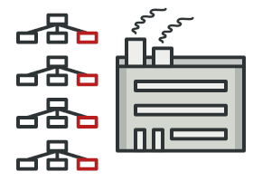
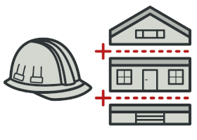
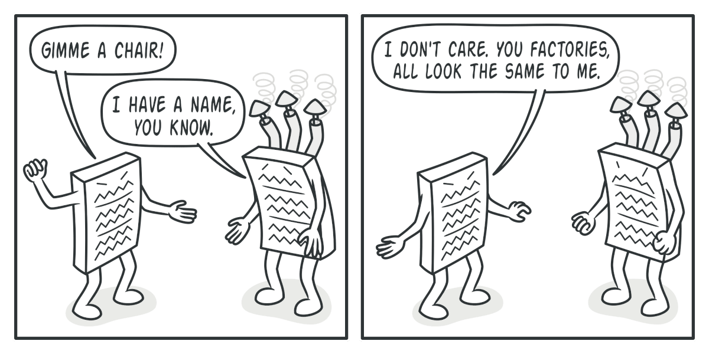
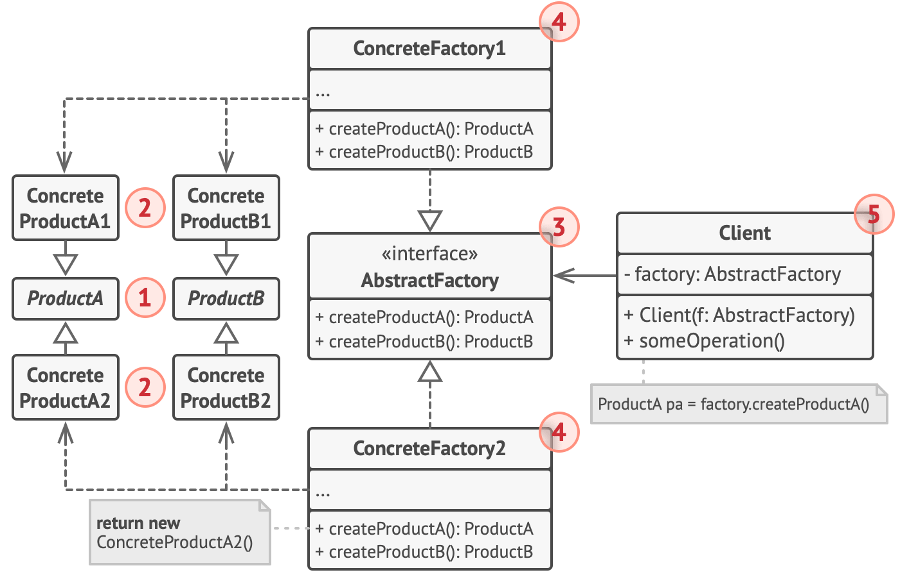

# CATALOG OF DESIGN PATTERNS

## Creational Design Patterns


Creational patterns provide various object creation mechanisms, which increase flexibility and reuse of existing code.

> ### [Factory Method](#factory-method-1)
> [](#factory-method-1) </br>
> [Provides an interface for creating objects in a superclass, but allows subclasses to alter the type of objects that will be created.](#factory-method-1)

> ### [Abstract Factory](#abstract-factory-1)
> [](#abstract-factory-1) </br>
> [Lets you produce families of related objects without specifying their concrete classes.](#abstract-factory-1)

> ### [Builder](#builder-1)
> [](#builder-1) </br>
> [Lets you construct complex objects step by step. The pattern allows you to produce different types and representations of an object using the same construction code.](#builder-1)

> ### [Prototype](#prototype-1)
> [](#prototype-1) </br>
> [Lets you copy existing objects without making your code dependent on their classes.](#prototype-1)

> ### [Singleton](#singleton-1)
> [](#singleton-1) </br>
> [Lets you ensure that a class has only one instance, while providing a global access point to this instance.](#singleton-1)

---


## Factory Method

###### Also known as: Virtual Constructor

**Factory Method** is a creational design pattern that provides an interface for creating objects in a superclass, but allows subclasses to alter the type of objects that will be created.

### :worried: Problem

Imagine that you’re creating a logistics management application. The first version of your app can only handle transportation by trucks, so the bulk of your code lives inside the Truck class.

After a while, your app becomes pretty popular. Each day you receive dozens of requests from sea transportation companies to incorporate sea logistics into the app.


Adding a new class to the program isn’t that simple if the rest of the code is already coupled to existing classes.

Great news, right? But how about the code? At present, most of your code is coupled to the `Truck` class. Adding `Ships` into the app would require making changes to the entire codebase. Moreover, if later you decide to add another type of transportation to the app, you will probably need to make all of these changes again.

As a result, you will end up with pretty nasty code, riddled with conditionals that switch the app’s behavior depending on the class of transportation objects.

### :smiley: Solution

The Factory Method pattern suggests that you replace direct object construction calls (using the new operator) with calls to a special factory method. Don’t worry: the objects are still created via the new operator, but it’s being called from within the factory method. Objects returned by a factory method are often referred to as products.


Subclasses can alter the class of objects being returned by the factory method.

At first glance, this change may look pointless: we just moved the constructor call from one part of the program to another. However, consider this: now you can override the factory method in a subclass and change the class of products being created by the method.

There’s a slight limitation though: subclasses may return different types of products only if these products have a common base class or interface. Also, the factory method in the base class should have its return type declared as this interface.


All products must follow the same interface.

For example, both `Truck` and `Ship` classes should implement the `Transport` interface, which declares a method called `deliver`. Each class implements this method differently: trucks deliver cargo by land, ships deliver cargo by sea. The factory method in the `RoadLogistics` class returns truck objects, whereas the factory method in the `SeaLogistics` class returns ships.

The code that uses the factory method (often called the client code) doesn’t see a difference between the actual products returned by various subclasses. The client treats all the products as abstract `Transport`.


As long as all product classes implement a common interface, you can pass their objects to the client code without breaking it.

The client knows that all transport objects are supposed to have the `deliver` method, but exactly how it works isn’t important to the client.

### :construction: Structure


1. The **Product** declares the interface, which is common to all objects that can be produced by the creator and its subclasses

2. **Concrete Products** are different implementations of the product interface.

3. The **Creator** class declares the factory method that returns new product objects. It’s important that the return type of this method matches the product interface.

You can declare the factory method as abstract to force all subclasses to implement their own versions of the method. As an alternative, the base factory method can return some default product type.

Note, despite its name, product creation is **not** the primary responsibility of the creator. Usually, the creator class already has some core business logic related to products. The factory method helps to decouple this logic from the concrete product classes. Here is an analogy: a large software development company can have a training department for programmers. However, the primary function of the company as a whole is still writing code, not producing programmers.

4. **Concrete Creators** override the base factory method so it returns a different type of product.

Note that the factory method doesn’t have to **create** new instances all the time. It can also return existing objects from a cache, an object pool, or another source.

### :hash: Pseudocode

This example illustrates how the **Factory Method** can be used for creating cross-platform UI elements without coupling the client code to concrete UI classes.

The base dialog class uses different UI elements to render its window. Under various operating systems, these elements may look a little bit different, but they should still behave consistently. A button in Windows is still a button in Linux.


The cross-platform dialog example.


When the factory method comes into play, you don’t need to rewrite the logic of the dialog for each operating system. If we declare a factory method that produces buttons inside the base dialog class, we can later create a dialog subclass that returns Windows-styled buttons from the factory method. The subclass then inherits most of the dialog’s code from the base class, but, thanks to the factory method, can render Windows-looking buttons on the screen.

For this pattern to work, the base dialog class must work with abstract buttons: a base class or an interface that all concrete buttons follow. This way the dialog’s code remains functional, whichever type of buttons it works with.

Of course, you can apply this approach to other UI elements as well. However, with each new factory method you add to the dialog, you get closer to the **Abstract Factory** pattern. Fear not, we’ll talk about this pattern later.

```c++
// The creator class declares the factory method that must
// return an object of a product class. The creator's subclasses
// usually provide the implementation of this method.
    class Dialog is
    // The creator may also provide some default implementation
    // of the factory method.
    abstract method createButton():Button

    // Note that, despite its name, the creator's primary
    // responsibility isn't creating products. It usually
    // contains some core business logic that relies on product
    // objects returned by the factory method. Subclasses can
    // indirectly change that business logic by overriding the
    // factory method and returning a different type of product
    // from it.
    method render() is
        // Call the factory method to create a product object.
        Button okButton = createButton()
        // Now use the product.
        okButton.onClick(closeDialog)
        okButton.render()


// Concrete creators override the factory method to change the
// resulting product's type.
class WindowsDialog extends Dialog is
    method createButton():Button is
        return new WindowsButton()


class WebDialog extends Dialog is
    method createButton():Button is
        return new HTMLButton()


// The product interface declares the operations that all
// concrete products must implement.
interface Button is
    method render()
    method onClick(f)

// Concrete products provide various implementations of the
// product interface.
class WindowsButton implements Button is
    method render(a, b) is
        // Render a button in Windows style.
    method onClick(f) is
        // Bind a native OS click event.


class HTMLButton implements Button is
    method render(a, b) is
        // Return an HTML representation of a button.
    method onClick(f) is
        // Bind a web browser click event.


class Application is
    field dialog: Dialog

    // The application picks a creator's type depending on the
    // current configuration or environment settings.
    method initialize() is

    config = readApplicationConfigFile()

    if (config.OS == "Windows") then
        dialog = new WindowsDialog()
    else if (config.OS == "Web") then
        dialog = new WebDialog()
    else
        throw new Exception("Error! Unknown operating system.")


// The client code works with an instance of a concrete
// creator, albeit through its base interface. As long as
// the client keeps working with the creator via the base
// interface, you can pass it any creator's subclass.

method main() is
    this.initialize()
    dialog.render()

```

### :bulb: Applicability

:beetle: **Use the Factory Method when you don’t know beforehand the exact types and dependencies of the objects your code should work with.**

:sparkles: The Factory Method separates product construction code from the code that actually uses the product. Therefore it’s easier to extend the product construction code independently from the rest of the code.

For example, to add a new product type to the app, you’ll only need to create a new creator subclass and override the factory method in it.

**Use the Factory Method when you want to provide users of your library or framework with a way to extend its internal components.**

Inheritance is probably the easiest way to extend the default behavior of a library or framework. But how would the framework recognize that your subclass should be used instead of a standard component?

The solution is to reduce the code that constructs components across the framework into a single factory method and let anyone override this method in addition to extending the component itself.

Let’s see how that would work. Imagine that you write an app using an open source UI framework. Your app should have round `buttons`, but the framework only provides square ones. You extend the standard Button class with a glorious `RoundButton` subclass. But now you need to tell the main `UIFramework` class to use the new button subclass instead of a default one.

To achieve this, you create a subclass `UIWithRoundButtons` from a base framework class and override its `createButton` method. While this method returns `Button` objects in the base class, you make your subclass return `RoundButton` objects. Now use the `UIWithRoundButtons` class instead of `UIFramework`. And that’s about it!

**Use the Factory Method when you want to save system resources by reusing existing objects instead of rebuilding them each time.**

You often experience this need when dealing with large, resource-intensive objects such as database connections, file systems, and network resources.

Let’s think about what has to be done to reuse an existing object:

1. First, you need to create some storage to keep track of all of the created objects.

2. When someone requests an object, the program should look for a free object inside that pool.

3. … and then return it to the client code.

4. If there are no free objects, the program should create a new one (and add it to the pool).

That’s a lot of code! And it must all be put into a single place so that you don’t pollute the program with duplicate code.

Probably the most obvious and convenient place where this code could be placed is the constructor of the class whose objects we’re trying to reuse. However, a constructor must always return **new objects** by definition. It can’t return existing instances.

Therefore, you need to have a regular method capable of creating new objects as well as reusing existing ones. That sounds very much like a factory method.

### :clipboard: How to Implement

1. Make all products follow the same interface. This interface should declare methods that make sense in every product.

2. Add an empty factory method inside the creator class. The return type of the method should match the common product interface.

3. In the creator’s code find all references to product constructors. One by one, replace them with calls to the factory method, while extracting the product creation code into the factory method.

You might need to add a temporary parameter to the factory method to control the type of returned product.

At this point, the code of the factory method may look pretty ugly. It may have a large `switch` operator that picks which product class to instantiate. But don’t worry, we’ll fix it soon enough.

4. Now, create a set of creator subclasses for each type of product listed in the factory method. Override the factory method in the subclasses and extract the appropriate bits of construction code from the base method.

5. If there are too many product types and it doesn’t make sense to create subclasses for all of them, you can reuse the control parameter from the base class in subclasses.

For instance, imagine that you have the following hierarchy of classes: the base `Mail` class with a couple of subclasses: `AirMail` and `GroundMail`; the `Transport` classes are `Plane`, `Truck` and `Train`. While the `AirMail` class only uses Plane objects, `GroundMail` may work with both `Truck` and `Train` objects. You can create a new subclass (say `TrainMail`) to handle both cases, but there’s another option. The client code can pass an argument to the factory method of the `GroundMail` class to control which product it wants to receive.

6. If, after all of the extractions, the base factory method has become empty, you can make it abstract. If there’s something left, you can make it a default behavior of the method.


### ⚖️ Pros and Cons

:heavy_check_mark: You avoid tight coupling between the creator and the concrete products.

:heavy_check_mark: Single Responsibility Principle. You can move the product creation code into one place in the program, making the code easier to support.

:heavy_check_mark: Open/Closed Principle. You can introduce new types of products into the program without breaking existing client code.

:heavy_multiplication_x: The code may become more complicated since you need to introduce a lot of new subclasses to implement the pattern. The best case scenario is when you’re introducing the pattern into an existing hierarchy of creator classes.

### :arrows_counterclockwise: Relations with Other Patterns


- Many designs start by using **Factory Method** (less complicated and more customizable via subclasses) and evolve toward **Abstract Factory**, **Prototype**, or **Builder** (more flexible, but more complicated).

- **Abstract Factory** classes are often based on a set of **Factory Methods**, but you can also use **Prototype** to compose the methods on these classes.

- You can use **Factory Method** along with **Iterator** to let collection subclasses return different types of iterators that are compatible with the collections.

- **Prototype** isn’t based on inheritance, so it doesn’t have its drawbacks. On the other hand, Prototype requires a complicated initialization of the cloned object. **Factory Method** is based on inheritance but doesn’t require an initialization step.

- **Factory Method** is a specialization of **Template Method**. At the same time, a Factory Method may serve as a step in a large Template Method.

---


## Abstract Factory


**Abstract Factory** is a creational design pattern that lets you produce families of related objects without specifying their concrete classes.

### :worried: Problem

Imagine that you’re creating a furniture shop simulator. Your code consists of classes that represent:

1. A family of related products, say: `Chair` + `Sofa` + `CoffeeTable`.

2. Several variants of this family. For example, products `Chair` + `Sofa` + `CoffeeTable` are available in these variants: `Modern`, `Victorian`, `ArtDeco`.


Product families and their variants.

You need a way to create individual furniture objects so that they match other objects of the same family. Customers get quite mad when they receive non-matching furniture.


A Modern-style sofa doesn’t match Victorian-style chairs.

Also, you don’t want to change existing code when adding new products or families of products to the program. Furniture vendors update their catalogs very often, and you wouldn’t want to change the core code each time it happens.

### :smiley: Solution

The first thing the Abstract Factory pattern suggests is to explicitly declare interfaces for each distinct product of the product family (e.g., chair, sofa or coffee table). Then you can make all variants of products follow those interfaces. For example, all chair variants can implement the Chair interface; all coffee table variants can implement the CoffeeTable interface, and so on.


All variants of the same object must be moved to a single class hierarchy.

The next move is to declare the Abstract Factory—an interface with a list of creation methods for all products that are part of the product family (for example, `createChair`, `createSofa` and `createCoffeeTable`). These methods must return **abstract** product types represented by the interfaces we extracted previously: `Chair`, `Sofa`, `CoffeeTable` and so on.

Now, how about the product variants? For each variant of a product family, we create a separate factory class based on the `AbstractFactory` interface. A factory is a class that returns products of a particular kind. For example, the `ModernFurnitureFactory` can only create `ModernChair`, `ModernSofa` and `ModernCoffeeTable` objects.


Each concrete factory corresponds to a specific product variant.

The client code has to work with both factories and products via their respective abstract interfaces. This lets you change the type of a factory that you pass to the client code, as well as the product variant that the client code receives, without breaking the actual client code.



The client shouldn’t care about the concrete class of the factory it works with.

Say the client wants a factory to produce a chair. The client doesn’t have to be aware of the factory’s class, nor does it matter what kind of chair it gets. Whether it’s a Modern model or a Victorian-style chair, the client must treat all chairs in the same manner, using the abstract `Chair` interface. With this approach, the only thing that the client knows about the chair is that it implements the `sitOn` method in some way. Also, whichever variant of the chair is returned, it’ll always match the type of sofa or coffee table produced by the same factory object.

There’s one more thing left to clarify: if the client is only exposed to the abstract interfaces, what creates the actual factory objects? Usually, the application creates a concrete factory object at the initialization stage. Just before that, the app must select the factory type depending on the configuration or the environment settings.

### :construction: Structure



1. **Abstract Products** declare interfaces for a set of distinct but related products which make up a product family.

2. **Concrete Products** are various implementations of abstract products, grouped by variants. Each abstract product (chair/sofa) must be implemented in all given variants (Victorian/Modern).

3. The **Abstract Factory** interface declares a set of methods for creating each of the abstract products.

4. **Concrete Factories** implement creation methods of the abstract factory. Each concrete factory corresponds to a specific variant of products and creates only those product variants.

5. Although concrete factories instantiate concrete products, signatures of their creation methods must return corresponding abstract products. This way the client code that uses a factory doesn’t get coupled to the specific variant of the product it gets from a factory. The Client can work with any concrete factory/product variant, as long as it communicates with their objects via abstract interfaces.


### :hash: Pseudocode

This example illustrates how the **Abstract Factory** pattern can be used for creating cross-platform UI elements without coupling the client code to concrete UI classes, while keeping all created elements consistent with a selected operating system.


The cross-platform UI classes example.

The same UI elements in a cross-platform application are expected to behave similarly, but look a little bit different under different operating systems. Moreover, it’s your job to make sure that the UI elements match the style of the current operating system. You wouldn’t want your program to render macOS controls when it’s executed in Windows.


The Abstract Factory interface declares a set of creation methods that the client code can use to produce different types of UI elements. Concrete factories correspond to specific operating systems and create the UI elements that match that particular OS.

It works like this: when an application launches, it checks the type of the current operating system. The app uses this information to create a factory object from a class that matches the operating system. The rest of the code uses this factory to create UI elements. This prevents the wrong elements from being created.

With this approach, the client code doesn’t depend on concrete classes of factories and UI elements as long as it works with these objects via their abstract interfaces. This also lets the client code support other factories or UI elements that you might add in the future.

As a result, you don’t need to modify the client code each time you add a new variation of UI elements to your app. You just have to create a new factory class that produces these elements and slightly modify the app’s initialization code so it selects that class when appropriate.

```c++

// The abstract factory interface declares a set of methods that
// return different abstract products. These products are called
// a family and are related by a high-level theme or concept.
// Products of one family are usually able to collaborate among
// themselves. A family of products may have several variants,
// but the products of one variant are incompatible with the
// products of another variant.
interface GUIFactory is
    method createButton():Button
    method createCheckbox():Checkbox


// Concrete factories produce a family of products that belong
// to a single variant. The factory guarantees that the
// resulting products are compatible. Signatures of the concrete
// factory's methods return an abstract product, while inside
// the method a concrete product is instantiated.
class WinFactory implements GUIFactory is
    method createButton():Button is
        return new WinButton()
    method createCheckbox():Checkbox is
        return new WinCheckbox()


// Each concrete factory has a corresponding product variant.
class MacFactory implements GUIFactory is
    method createButton():Button is
        return new MacButton()
    method createCheckbox():Checkbox is
        return new MacCheckbox()


// Each distinct product of a product family should have a base
// interface. All variants of the product must implement this
// interface.

interface Button is
    method paint()


// Concrete products are created by corresponding concrete
// factories.
class WinButton implements Button is
    method paint() is
        // Render a button in Windows style.
class MacButton implements Button is
    method paint() is
        // Render a button in macOS style.


// Here's the base interface of another product. All products
// can interact with each other, but proper interaction is
// possible only between products of the same concrete variant.
interface Checkbox is
    method paint()


class WinCheckbox implements Checkbox is
    method paint() is
        // Render a checkbox in Windows style.

class MacCheckbox implements Checkbox is
    method paint() is
        // Render a checkbox in macOS style.


// The client code works with factories and products only
// through abstract types: GUIFactory, Button and Checkbox. This
// lets you pass any factory or product subclass to the client
// code without breaking it.
class Application is
    private field factory: GUIFactory
    private field button: Button
    constructor Application(factory: GUIFactory) is
        this.factory = factory
    method createUI() is
        this.button = factory.createButton()
    method paint() is
        button.paint()

// The application picks the factory type depending on the
// current configuration or environment settings and creates it
// at runtime (usually at the initialization stage).
class ApplicationConfigurator is
    method main() is
        config = readApplicationConfigFile()

    if (config.OS == "Windows") then
        factory = new WinFactory()
    else if (config.OS == "Mac") then
        factory = new MacFactory()
    else
        throw new Exception("Error! Unknown operating system.")

    Application app = new Application(factory)

```

### :bulb: Applicability

:beetle: **Use the Abstract Factory when your code needs to work with various families of related products, but you don’t want it to depend on the concrete classes of those products—they might be unknown beforehand or you simply want to allow for future extensibility.**

:sparkles: The Abstract Factory provides you with an interface for creating objects from each class of the product family. As long as your code creates objects via this interface, you don’t have to worry about creating the wrong variant of a product which doesn’t match the products already created by your app.

- Consider implementing the Abstract Factory when you have a class with a set of Factory Methods that blur its primary responsibility.

- In a well-designed program each class is responsible only for one thing. When a class deals with multiple product types, it may be worth extracting its factory methods into a stand-alone factory class or a full-blown Abstract Factory implementation.

### :clipboard: How to Implement

1. Map out a matrix of distinct product types versus variants of these products.

2. Declare abstract product interfaces for all product types. Then make all concrete product classes implement these interfaces.

3. Declare the abstract factory interface with a set of creation methods for all abstract products.

4. Implement a set of concrete factory classes, one for each product variant.

5. Create factory initialization code somewhere in the app. It should instantiate one of the concrete factory classes, depending on the application configuration or the current environment. Pass this factory object to all classes that construct products.

6. Scan through the code and find all direct calls to product constructors. Replace them with calls to the appropriate creation method on the factory object.

### ⚖️ Pros and Cons

:heavy_check_mark: You can be sure that the products you’re getting from a factory are compatible with each other.

:heavy_check_mark: You avoid tight coupling between concrete products and client code.

:heavy_check_mark: Single Responsibility Principle. You can extract the product creation code into one place, making the code easier to support.

:heavy_check_mark: Open/Closed Principle. You can introduce new variants of products without breaking existing client code.

:heavy_multiplication_x: The code may become more complicated than it should be, since a lot of new interfaces and classes are introduced along with the pattern.

### :arrows_counterclockwise: Relations with Other Patterns

- Many designs start by using **Factory Method** (less complicated and more customizable via subclasses) and evolve toward **Abstract Factory**, **Prototype**, or **Builder** (more flexible, but more complicated).

- **Builder** focuses on constructing complex objects step by step. **Abstract** Factory specializes in creating families of related objects. Abstract Factory returns the product immediately, whereas Builder lets you run some additional construction steps before fetching the product.

- **Abstract Factory** classes are often based on a set of **Factory Methods**, but you can also use **Prototype** to compose the methods on these classes.

- **Abstract Factory** can serve as an alternative to **Facade** when you only want to hide the way the subsystem objects are created from the client code.

- You can use **Abstract Factory** along with **Bridge**. This pairing is useful when some abstractions defined by Bridge can only work with specific implementations. In this case, Abstract Factory can encapsulate these relations and hide the complexity from the client code.

- **Abstract Factories**, **Builders** and **Prototypes** can all be implemented as **Singletons**.
